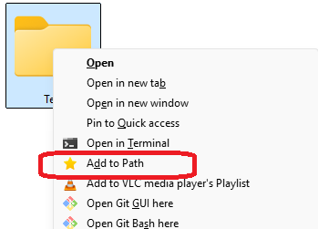
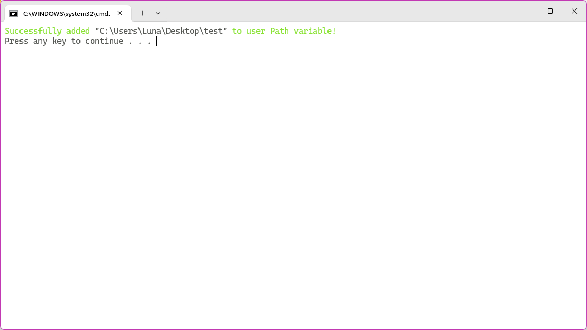

# Add to Path Windows context menu item

## Description

Add folders to your user PATH variable from the Windows context menu

## Installation

Clone the repository using `git clone https://github.com/BiiirdPrograms/add-to-path.git` or download the zip file from the **Releases** menu.

Install by running `install.bat`.

Uninstall by running `uninstall.bat`.

## Usage

Right click any folder, then click "Add to Path" (or use the shorthand key "d").

A cmd window will appear confirming the addition.

